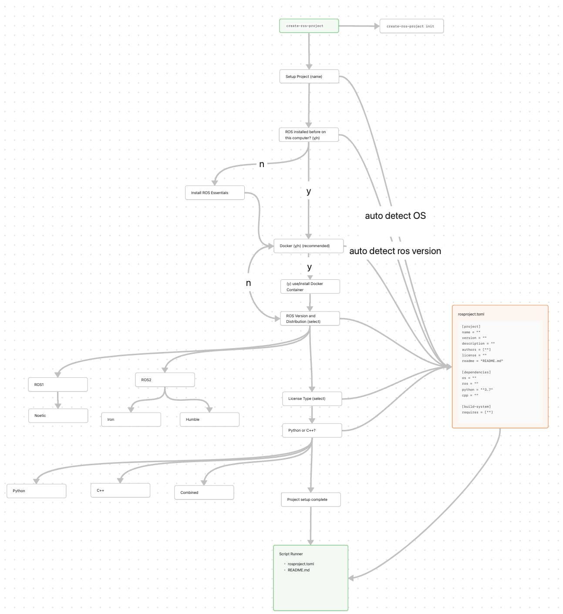

import { Callout } from 'nextra/components'
import Image from 'next/image'

<Callout type="warning" emoji="⚠️">
    Work in Progress
</Callout>

## Build Tools
We want to have a trivial install process and a single command to run to get a working ROS environment. Golang makes this easy, as the go compiler outputs a single, standalone executable with no system dependencies. This includes system libraries, so we don't need to worry about where libc is on a given linux machine for example (different distributions put it in different places). Go can also be compiled for many operating systems and architectures, including everything ROS runs on. A single standalone executable means that all any automated install has to do is grab the executable from where releases are hosted for the appropriate platform, and put it somewhere reasonable on the system (in PATH). That's it. In fact its so easy that anyone can do it themselves just downloading the executable and dropping it in their PATH.

Additionally, go has a rich ecosystem of libraries and utilities just for writing command line applications like ours. e.g. charm. Many important CLI applications leverage go and its ecosystem such as the github CLI and lazygit.

Finally, go is designed to be extremely simplex (opposite of complex). We can build what we need to with satisfactory technical properties and move on with our lives. Alternatives such as rust and c++ share potentially similar desirable technical properties and CLI ecosystems, but come with enormous complexity.

## Setup Flow

## Contribute
Please create PR or open up an issue at https://github.com/jingxiangmo/create-ros-project. Thank you for your support!

